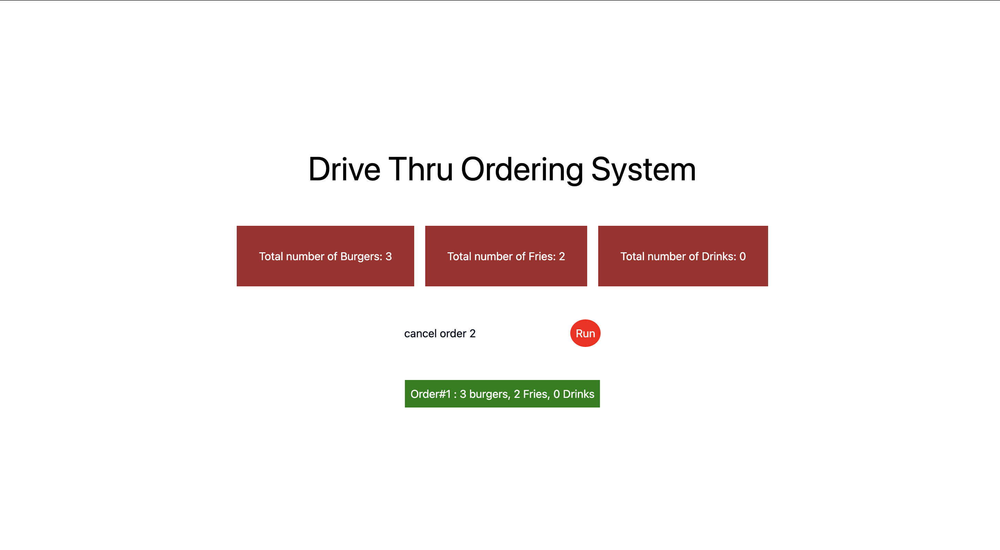

# Drive Thru Ordering System

# Setup Instructions

1. **Clone the Repository**: 
   ```bash
   git clone <https://github.com/siddharthmohite/voker-assessment.git>
   cd voker-assessment
   ```
2. create a virtual environment and activate it:
   ```bash
   python3 -m venv .venv
   source .venv/bin/activate # For MacOS
   ```
3. Install the required dependencies:
   ```bash
   pip install -r requirements.txt
   ```        
4. Set the environment variable for the API key:
   ```bash
   export GEMINI_API_KEY = ""
   ```
5. Run the FastAPI server:
   ```bash   
   cd backend
   fastapi dev main.py
    ```
6. Run the frontend (in a new terminal):
   ```bash
   cd voker-assessment/frontend
   npm install
   npm run dev
   ```
